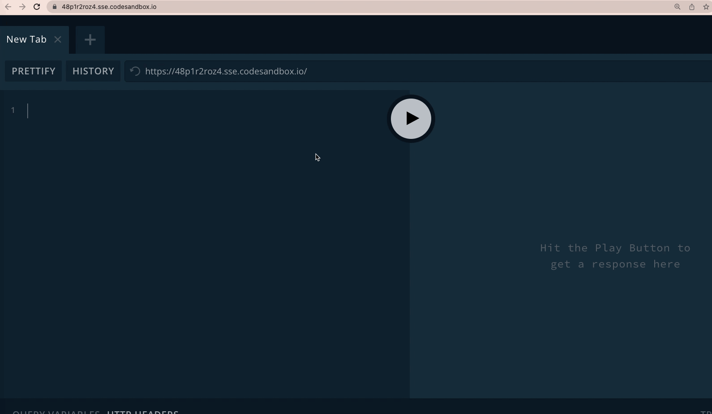

Graphql + React [simple example](https://graphql-react-example.netlify.app/)
----


---------

### Creat React typescript project
```shell
$ npx create-react-app my-app --template typescript
```
---------

### Connect Apollo Client to React with the ApolloProvider component. [src/index.tsx](src/index.tsx)
```tsx
import {
    ApolloClient,
    InMemoryCache,
    ApolloProvider
} from "@apollo/client";

const client = new ApolloClient({
    uri: 'https://48p1r2roz4.sse.codesandbox.io',
    cache: new InMemoryCache()
});

render(
    <ApolloProvider client={client}>
        <App />
    </ApolloProvider>,
    document.getElementById('root'),
);
```

---------

### Fetch data with useQuery that shares GraphQL data with your UI. [src/App.tsx](src/App.tsx)

```tsx
import React from 'react';
import './App.css';
import {gql, useQuery} from "@apollo/client";

const EXCHANGE_RATES = gql`
  query GetExchangeRates {
    rates(currency: "USD") {
      currency
      rate
    }
  }
`;

function ExchangeRates() {
    const {loading, error, data} = useQuery(EXCHANGE_RATES);

    if (loading) return <p>Loading...</p>;
    if (error) return <p>Error :(</p>;

    return data.rates.map(({currency, rate}: { currency: string, rate: number }) => (
        <div key={currency}>
            <p>
                {currency}: {rate}
            </p>
        </div>
    ));
}

function App() {
    return (
        <div>
            <h2>get "Currency Exchange Rates" using Apollo & Graphql</h2>
            <ExchangeRates/>
        </div>
    );
}

export default App;
```

---------

## Official documentation [link](https://www.apollographql.com/docs/react/get-started/)
